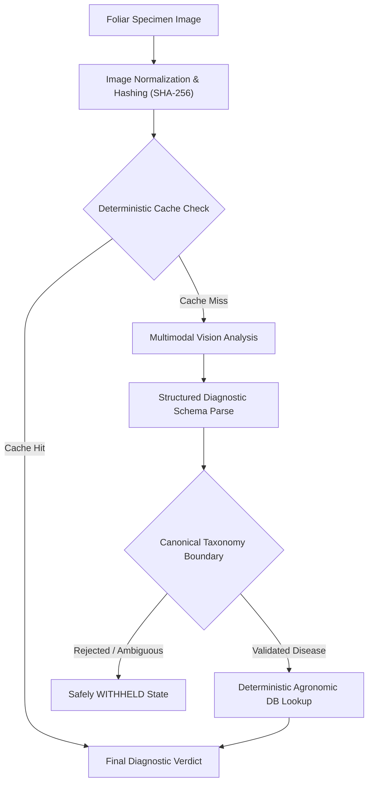

# PhytoGATE

### Plant Pathology Intelligence & Assistive Agronomic Diagnostic Platform

PhytoGATE is a plant pathology vision intelligence system engineered to screen, identify, and evaluate foliar crop diseases from photographic field specimens. Built on a safety-first architecture, PhytoGATE bridges multimodal visual reasoning with deterministic agronomic validation to prevent ungrounded predictions, eliminate fabricated certainty, and provide actionable, verified treatment guidance.

---

## Overview

Agricultural producers and crop scouts frequently encounter foliar abnormalities requiring immediate triage. Traditional computer vision classifiers often suffer from high false-positive rates on ambiguous field photography, fabricate confidence percentages on novel pathogens, or guess diseases from irrelevant image metadata.

PhytoGATE addresses these limitations through a **disease-first, verified-taxonomy architecture**:
1. **Multimodal Visual Inspection**: Evaluates foliar morphology, lesion patterns, chlorosis, and necrosis.
2. **Strict Taxonomy Boundaries**: Validates all visual inferences against a canonical pathology database across 9 agricultural hosts and 40 verified disease conditions.
3. **Explicit Diagnostic Withholding**: Honestly withholds diagnosis whenever evidence is ambiguous, imaging conditions are sub-optimal, or non-botanical objects are presented.
4. **Deterministic Agronomic Treatment**: Decouples visual inference from agronomic protocol, retrieving treatment and IPM regimens purely from local agronomic databases.

---

## Core Capabilities

| Capability | Architectural Implementation |
| :--- | :--- |
| **Image-Based Plant Inspection** | Photographic leaf intake with automatic resolution normalization (max 1024px) preserving aspect ratio and diagnostic fidelity. |
| **Disease Identification** | Primary identification of foliar pathologies based strictly on visible diagnostic lesions, halos, and sporulation. |
| **Healthy Specimen Recognition** | Identifies vigorous, asymptomatic foliage without forcing spurious disease classifications. |
| **Non-Plant Rejection** | Automatically screens non-botanical objects, tools, or irrelevant imagery, withholding diagnostic output honestly. |
| **Disease-First Validation** | Primary focus on foliar disease pathology; accepts verified diseases even when host species is ambiguous or unspecified. |
| **Evidence Extraction** | Extracts observable morphological evidence (concentric rings, chlorotic halos, angular water-soaked margins) directly into structured diagnostics. |
| **Agronomic Treatment Integration** | Deterministically links confirmed diagnoses to verified cultural, chemical, biological, and preventive IPM management regimens. |
| **Uncertainty Handling & Withholding** | Returns an explicit `WITHHELD` status on rate limits, service interruptions, ambiguous symptoms, or non-canonical diagnoses. |

---

## Diagnostic Pipeline

PhytoGATE enforces a unidirectional, multi-stage validation pipeline:



1. **Specimen Intake & Normalization**: The raw photographic input is converted to standard RGB JPEG format and normalized to a maximum 1024px dimension, computing a deterministic SHA-256 hash.
2. **Deterministic Cache Evaluation**: Identical image specimens are served from memory in `< 2ms` with zero external inference calls.
3. **Multimodal Vision Analysis**: The visual engine evaluates foliar symptoms against structured diagnostic parameters.
4. **Structured Schema Validation**: Validates plant presence, visible pathology markers, differential diagnoses, and diagnostic limitations.
5. **Canonical Taxonomy Verification**: Matches findings against controlled botanical taxonomy (`Tomato`, `Potato`, `Apple`, `Corn`, `Grape`, `Pepper`, `Rice`, `Wheat`, `Soybean`).
6. **Agronomic Knowledge Retrieval**: Pulls verified cultural sanitation, fungicide classes, biological controls, and resistance profiles from the local database.
7. **Final Diagnostic Verdict**: Generates the complete clinical report or withholds diagnosis with clear explanation.

---

## Safety & Reliability Guarantees

* **Zero Filename Inference**: Filenames and client metadata are completely ignored. Diagnosis is driven 100% by visible leaf tissue.
* **No Fabricated Confidence Scores**: PhytoGATE never outputs synthetic percentages or arbitrary certainty numbers. Assessments are strictly qualitative (`high`, `medium`, `low`, or `unknown`).
* **Honest Withholding (`WITHHELD`)**: On provider failure, network timeout, rate limiting, or taxonomy mismatch, PhytoGATE outputs an honest `WITHHELD` state rather than guessing.
* **Separation of Inference and Treatment**: Treatment recommendations are never generated by generative visual inference. They are retrieved deterministically from local peer-referenced agronomy tables.
* **Non-Persistent In-Memory Cache**: Deterministic caching is maintained per runtime instance and safe for serverless/ephemeral environments.

---

## Diagnostic Interface

PhytoGATE provides a clean, responsive web console designed for field workstations and mobile inspection:

* **Foliar Ingest Dropzone**: Drag-and-drop intake supporting JPEG, PNG, and WebP specimens.
* **Specimen Quick-Select Grid**: Built-in demonstration specimens representing fungal leaf spot, foliar disease, and healthy foliage.
* **Real-time Telemetry Bar**: Live monitoring of system readiness, active diagnostic engine, and deterministic cache performance.
* **Diagnostic Verdict Card**: Color-coded diagnostic cards highlighting confirmed host, disease, qualitative assessment, visible evidence markers, and differential considerations.
* **Integrated Agronomic Protocols**: Tabbed agronomic recommendations detailing cultural practices, chemical options, organic solutions, and prevention regimens.

---

## Architecture & Technology

* **Backend Engine**: FastAPI ASGI application with strict Pydantic v2 data models.
* **Vision Abstraction**: Decoupled provider interface supporting multimodal inference with deterministic error boundaries.
* **Taxonomy Engine**: Multi-tier fuzzy matching and synonym normalizer with strict safety fallbacks.
* **Agronomic Knowledge Base**: In-memory, zero-latency clinical treatment database.
* **Frontend**: Pure HTML5/ES6 architecture with zero heavy frontend build dependencies, styled with an agronomic color palette.

---

## Deployment

PhytoGATE is configured for zero-config serverless deployment (including Vercel and containerized environments):

### Environment Variables

Configure the following variables in your deployment environment:

| Variable | Description | Default |
| :--- | :--- | :--- |
| `VISION_PROVIDER` | Active vision provider engine | `groq` |
| `GROQ_API_KEY` | Multimodal vision API key (server-side only) | *(Required)* |
| `GROQ_MODEL` | Vision model identifier | `qwen/qwen3.8-27b` |
| `GROQ_TIMEOUT_SECONDS` | Maximum inference timeout in seconds | `30` |
| `HOST` | Local binding host | `127.0.0.1` |
| `PORT` | Local binding port | `8000` |

### Local Development

1. Clone the repository:
   ```bash
   git clone https://github.com/totaliyahtrash/LivePhytoGATE.git
   cd LivePhytoGATE
   ```

2. Install runtime dependencies:
   ```bash
   pip install -r requirements.txt
   ```

3. Configure environment:
   ```bash
   cp .env.example .env
   # Edit .env with your credentials
   ```

4. Launch the application:
   ```bash
   python server.py
   ```
   Open `http://127.0.0.1:8000` in your browser.

---

## Project Structure

```
phytogate/
├── api/
│   └── index.py            # Vercel Serverless Function entrypoint
├── samples/                # Built-in demonstration foliar specimens
│   ├── sample_foliar_leaf.jpg
│   ├── sample_healthy_leaf.jpg
│   └── sample_leaf_fungus.jpg
├── src/
│   ├── config.py           # Sanitized runtime configuration
│   ├── diagnostics.py      # Diagnostic core pipeline & caching
│   ├── disease_db.py       # Deterministic agronomic knowledge base
│   ├── taxonomy.py         # Canonical crop/disease taxonomy engine
│   ├── vision_overlays.py  # Image normalization & analysis
│   └── vision_provider.py  # Decoupled vision provider abstraction
├── static/
│   ├── css/style.css       # Diagnostic console styling
│   ├── js/app.js           # Client-side application controller
│   └── index.html          # Web console UI dashboard
├── server.py               # FastAPI application server
├── vercel.json             # Vercel serverless routing configuration
├── requirements.txt        # Production runtime dependencies
└── README.md               # Project documentation
```

---

## Disclaimer

PhytoGATE is an automated computational screening tool designed to assist agricultural professionals, growers, and researchers. Visual foliar symptoms may overlap between fungal, bacterial, viral, and abiotic nutritional deficiencies. Definitive diagnosis for high-value crops should be confirmed through physical laboratory assay, microscopic evaluation, or consultation with an accredited agricultural extension specialist before applying chemical treatments.
